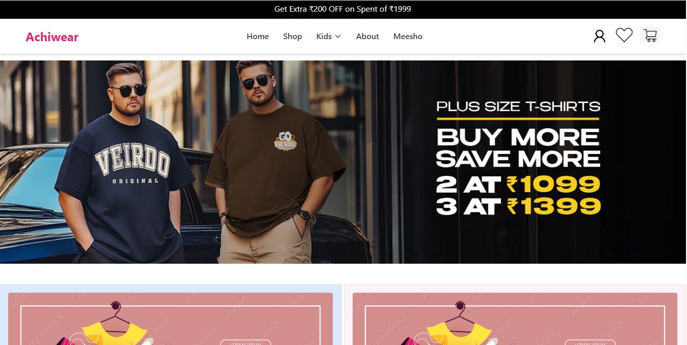
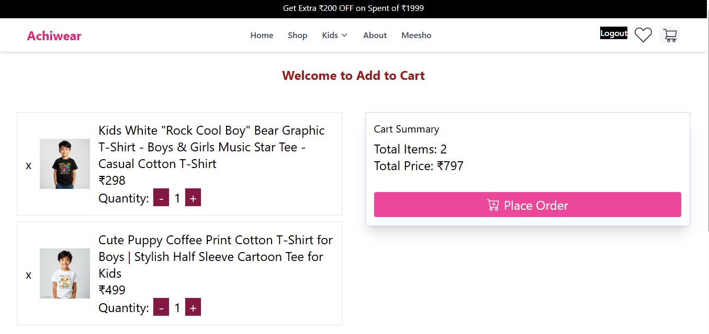
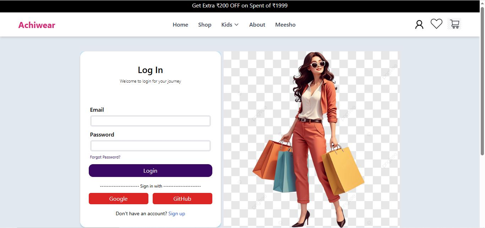
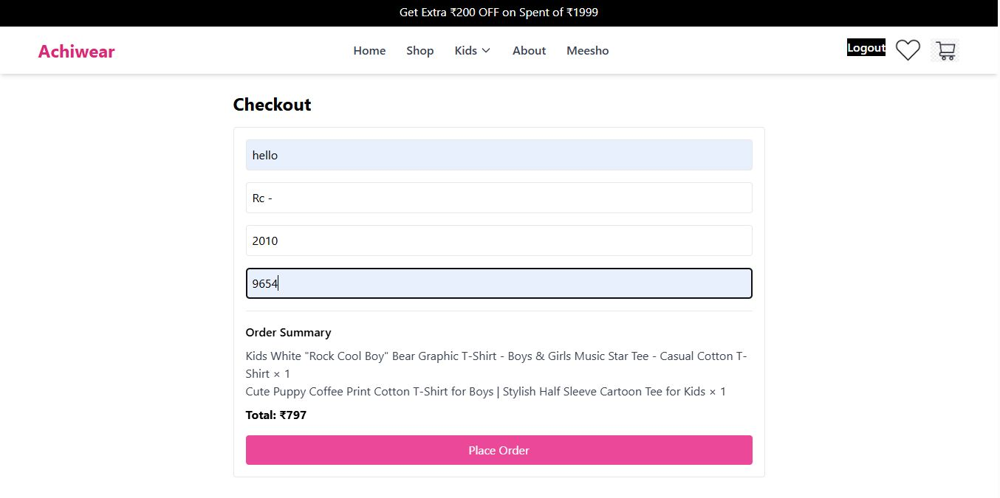
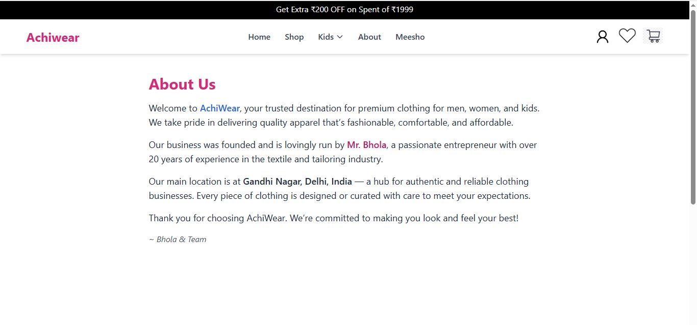
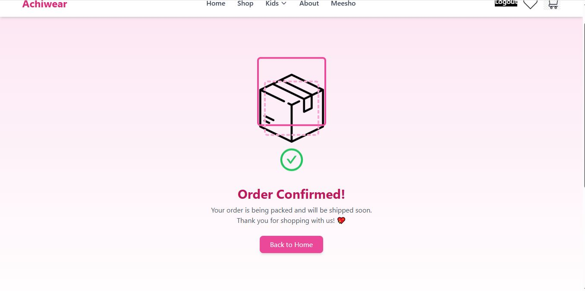

🛍️ Achiwear – Modern E-Commerce Website

Achiwear is a full-stack e-commerce web application built with React, Tailwind CSS, Node.js, Express, and MongoDB.
It allows users to browse products, add to cart, place orders, and manage authentication with JWT.

🚀 Features

🖥️ Responsive UI with Tailwind CSS

🔐 User Authentication (Signup/Login with JWT)

🛒 Add to Cart / Remove from Cart

📦 Order Management

🖼️ Multiple Product Images with Preview

🌐 Deployed on Netlify (Frontend) & Render (Backend)
🚀 Features

🖥️ Responsive UI with Tailwind CSS

🔐 User Authentication (Signup/Login with JWT)

🛒 Add to Cart / Remove from Cart

📦 Order Management

🖼️ Multiple Product Images with Preview

🌐 Deployed on Netlify (Frontend) & Render (Backend)

📸 Screenshots
🏠 Homepage

🛒 Product Page

🛍️ Cart Page

🔐 Authentication

🛠️ Tech Stack

Frontend:

React.js

Tailwind CSS

Axios

React Router DOM

Backend:

Node.js

Express.js

MongoDB with Mongoose

JWT Authentication

Deployment:

Frontend → Netlify

Backend → Render

🌐 Deployment

Frontend: Netlify Link

Backend: Render API

👨‍💻 Author

Developed by Suraj
 ✨

--> Project Not complete and Some Change Occur in project 

--> This project not free for use ....

--> Client based Project 

 ### 🏠 Homepage  
  

### 🛒 Product Page  
  

### 🛍️ Cart Page  
  

### 🔐 Authentication  
  

### 🛍️ CheckOut  

### 🛒 About  
  

### 🛒 Order   
  

